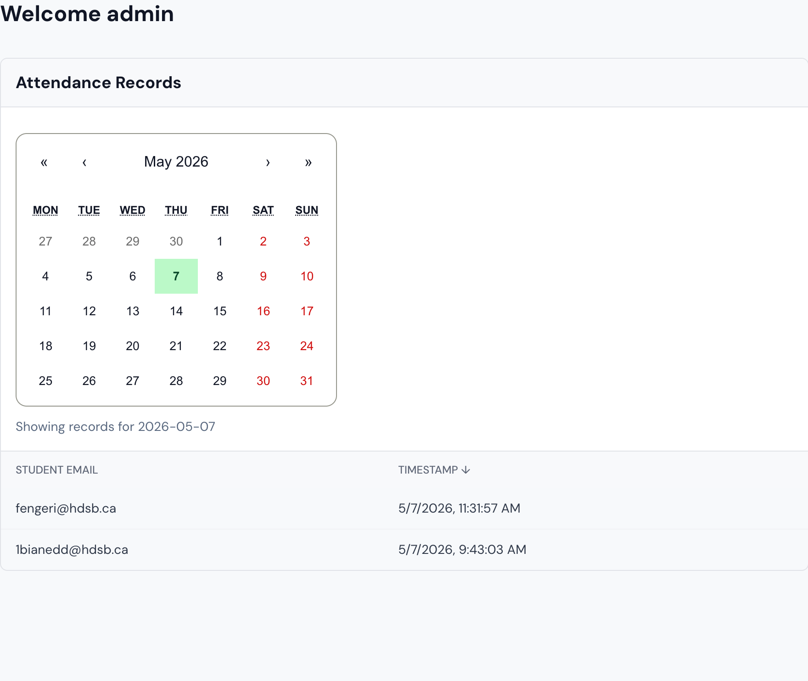

 

https://github.com/user-attachments/assets/ee56934d-255f-44c1-82c2-103b78cb41c4

# GWL signup form
This is a web version of a daily signup sheet. Try it at this link:

    $ https://gwl.vercel.app

## The problem
My school has a (useless ahh) course called "GWL". It only runs every wednesdays at break, and on the other days, we need to "sign in" by writing our name on a paper sheet. However, this takes way to long to walk to the sheet (which is at the corner of one of our campuses) and most of us just get our friends to sign up for us.

It's not only students that waste time on this, but the teachers also spend way too long on this. They need to take a picture of the signup sheet every single day and then manually log on their online system which students signed up and which ones didn't. But, since a lot of student don't wan't to sign this form every day, a lot of them just pre-sign some days. So, the teachers need to use white-out to cross out their names.

## The solution?
This web app moves the whole process online by allowing students to create an account using their HDSB emails. When students try signing in, the app checks their location and the date to verify their sign-in. An admin account has access to every sign-in and provides it in a format that is easy to transfer to the system.

## The future
I'm planning to talk with my GWL teacher and admin to actually implement the site in my school. I've heard HDSB is really strict about putting apps on their site, so as a my-school-only-thing, I hope my school will at least let me run it as is, on vercel.

## Tech Stack
- Next.JS, Tailwind, Supabase

## Features
- Signin/Login
- Geolocation verification
- Admin panel - attendance records view

## Challenges
This is the first project I made after a year-long break from coding due to IB. So, I kinda forgot a lot of my knowledge and spent a lot of time debugging and relearning concepts. I also haven't used React a lot since I made most of my stuff before in Flask, so again, a lot of debugging.
Looking back, this should NOT have been that hard. But, making this helped me regain some of my experience.

## To Add:
- Making the dashboard follow the styling of the other pages
- Scaling - make the app work for more than 1 school (currently tailored for White Oaks SS)
- sign out button (it disappeared)
